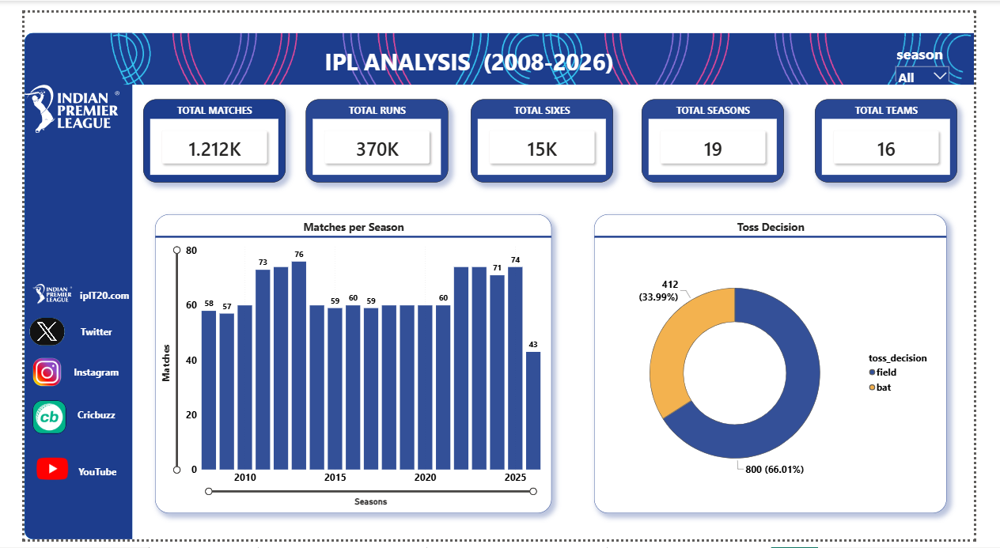
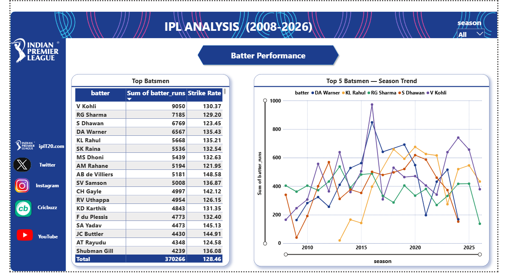
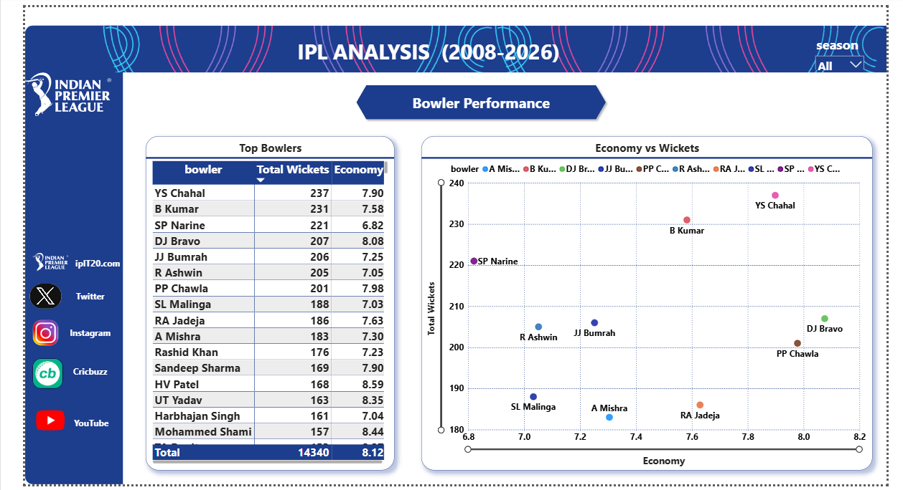
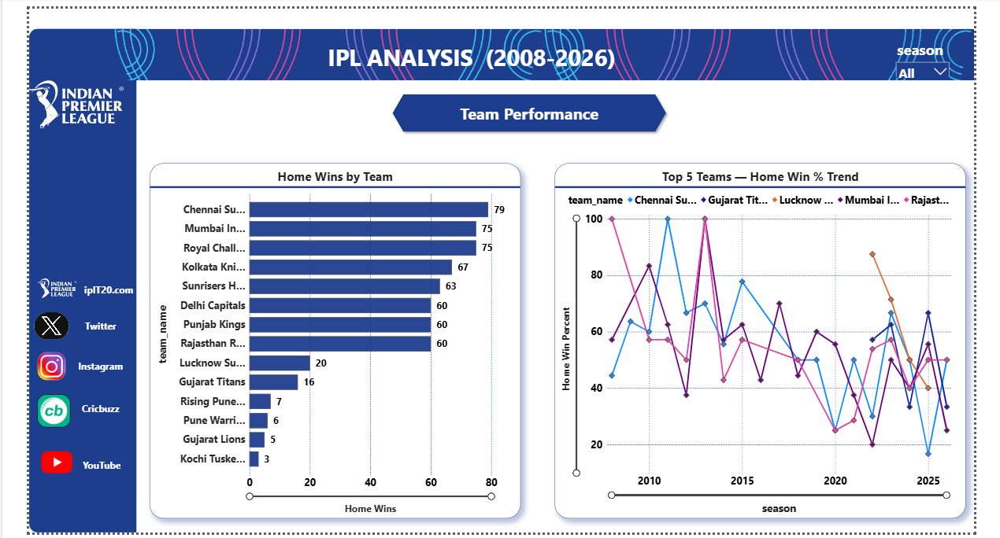

# IPL Cricket Analytics (2008-2026)

### End-to-End Data Pipeline: Python → MySQL → Power BI → Excel

**Overview**



**Batter Performance**



**Bowler Performance**



**Team Performance**



## Project Overview

Analyzed IPL cricket data spanning 2008-2026 (1,212 matches, 288,000+ ball-by-ball records) to answer business questions around team performance, player consistency, and match dynamics — using a complete data pipeline from raw data to an interactive dashboard.

## Tech Stack

| Tool | Purpose |
|------|---------|
| Python (Pandas) | Data cleaning + exploratory data analysis |
| MySQL | Data storage + business analysis via SQL |
| Power BI | 4-page interactive dashboard with DAX measures |
| Excel | Executive summary report with conditional formatting |

## Data Pipeline

1. **Python** — Loaded raw CSVs from Kaggle, handled missing values, fixed data types, standardized column names, generated 5 exploratory graphs (season trends, top scorers, toss patterns)

2. **Python → MySQL** — Instead of manually importing CSVs through a GUI wizard, cleaned DataFrames were pushed directly into MySQL using SQLAlchemy's `create_engine()` and `to_sql()`. This handled 288,000+ rows reliably in one step and reflects how automated pipelines move data in real workflows.

3. **MySQL** — Wrote 11 business queries using joins, window functions (RANK, DENSE_RANK, ROW_NUMBER, LAG), and aggregations to answer the business questions below

4. **MySQL → Power BI** — Power BI connected directly to the MySQL database (Import mode) rather than importing static CSVs again, so the dashboard pulls from the same cleaned tables used for SQL analysis. Built 4 dashboard pages with custom DAX measures and a consistent navy/gold color theme.

5. **Excel** — Summarized key findings with conditional formatting and an insights sheet

## Key Business Questions Answered

1. Who are the top 10 run scorers of all time?
2. Does winning the toss increase a team's chances of winning the match?
3. Who is the top run scorer in each season?
4. How does each player's performance compare to their previous season?
5. Which team scores the most runs in death overs (16-20)?
6. Who is the most economical bowler in the powerplay (overs 1-6)?
7. What is each team's home win percentage?
8. Who won the Orange Cap (most runs) each season?
9. Do teams prefer batting or fielding first after winning the toss?
10. Who is the highest individual scorer in each match?
11. Who are the top wicket-takers overall?

## Key Findings

- The toss-winning team also wins the match only **51.65%** of the time — close to a coin flip, meaning toss has minimal impact on match outcome
- **Chennai Super Kings** have the highest home win percentage (**56.43%**) and the most home wins (**79**), showing a genuine home-ground advantage
- **V Kohli** is the all-time leading run scorer, and holds the record for the highest single-season total — **973 runs in 2016**
- **YS Chahal** is the leading wicket-taker across all seasons

## Dashboard Pages

| Page | Focus |
|------|-------|
| Overview | Overall scale and trends (matches, runs, seasons, toss decisions) |
| Batter Performance | Top scorers and season-wise batting consistency |
| Bowlers Performance | Top wicket-takers and economy-vs-wickets efficiency |
| Team Performance | Home vs away performance and win percentage trends |

## Dataset

Source: [Kaggle - IPL Dataset 2008 to 2026](https://www.kaggle.com/datasets/maratheabhishek/ipl-dataset-2008-to-2025) by maratheabhishek

Files used: `ipl_matches_data.csv`, `ball_by_ball_data.csv`, `players-data-updated.csv`, `teams_data.csv`, `team_aliases.csv`

## Data Limitations

- The 2026 season data appears incomplete — some Orange Cap and win-percentage figures for 2026 don't fully match publicly reported season-end standings, likely because the dataset was captured before the season's final matches were played. This was verified by cross-checking against current standings rather than assumed.
- The `team1` column was treated as the home team for home-advantage calculations, based on city-wise pattern verification (each team appeared far more often as `team1` in matches played in its own city). No explicit home/away column existed in the source data.

## How to Reproduce

1. Download the dataset from the Kaggle link above and place the CSVs in the project folder
2. Run `Data_clean_IPL.ipynb` to clean the data and generate `*_clean.csv` files
3. Run `IPL_EDA_Visualization.ipynb` for exploratory graphs
4. Set up a local MySQL database named `ipl_db`, then run the Python cell that pushes data via SQLAlchemy (`to_sql()`)
5. Run the queries in `SQL_IPL_PROJECT.sql` in MySQL Workbench
6. Open `IPL_PROJECT_BI.pbix` in Power BI Desktop and update the MySQL connection credentials under Transform Data → Data Source Settings

## Project Structure

```
IPL-Cricket-Analytics/
├── Data_clean_IPL.ipynb
├── IPL_EDA_Visualization.ipynb
├── SQL_IPL_PROJECT.sql
├── IPL_PROJECT_BI.pbix
├── IPL_Summary_Report.xlsx
├── dashboard_screenshot.png
└── README.md
```

## About Me

Fresher Data Analyst with hands-on skills in Power BI, SQL, Excel, and Python. This project reflects an end-to-end pipeline built independently — from raw data to an interactive, business-focused dashboard.

Connect with me on [LinkedIn](https://www.linkedin.com/in/vansh-devkant-397ba62a1)
